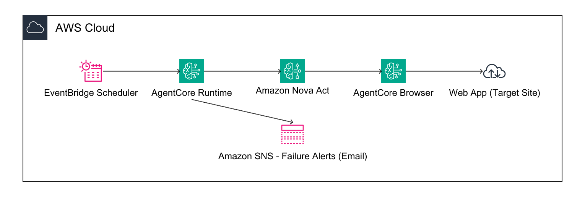

# Synthetic Monitoring with Nova Act CLI

Automated synthetic monitoring for e-commerce workflows using Amazon Nova Act and Bedrock AgentCore. Browser-based synthetic tests run serverlessly on AgentCore Runtime with SNS alerting on failures.

## Architecture



- **Nova Act**: AI-powered browser automation for e-commerce journey testing
- **AgentCore Runtime**: Serverless container execution
- **AgentCore Browser**: Secure, isolated browser sessions with CDP access
- **EventBridge Scheduler**: Automated workflow execution every 10 minutes
- **SNS**: Failure alerts for journey failures and infrastructure alarms

## Project Structure

```
├── workflow.py              # Main workflow with all test journeys
├── deploy.py                # Deployment script (idempotent)
├── cdk_stack.py             # Production CDK stack (alarms, DLQ, IaC)
├── app.py                   # CDK app entry point
├── cdk.json                 # CDK configuration
├── test_all_journeys.py     # Test script — runs all journeys against AgentCore
├── requirements.txt         # Python dependencies
├── architecture-base.png    # Solution architecture diagram
├── .actignore               # Files excluded from deployment
└── README.md
```

## Test Journeys

The workflow supports three journey types via the `journey_type` payload parameter:

| Journey | Description |
|---------|-------------|
| `login` | Basic login with valid credentials, verify products page |
| `ecommerce` | Full flow: login → add to cart → checkout → order confirmation → logout |
| `login_failure` | Attempts login with invalid credentials — verifies the rejection mechanism works. Triggers SNS alert only if wrong credentials succeed (auth bypass detected). |

Any journey that returns `status: "failed"` (or throws an exception) automatically sends an SNS notification.

## Prerequisites

- Python 3.11+
- Docker (Docker Desktop or Colima)
- AWS CLI v2 configured with credentials
- AWS account with access to: Nova Act, Bedrock AgentCore, ECR, IAM, EventBridge, SNS

## Quick Start

### 1. Setup

```bash
python -m venv .venv
source .venv/bin/activate
pip install -r requirements.txt
```

### 2. Deploy

```bash
# Basic deploy
python deploy.py

# Deploy with SNS failure notifications
python deploy.py --email your-email@example.com
```

This will:
- Validate prerequisites (Python, Docker, AWS)
- Build and push Docker container to ECR
- Deploy to AgentCore Runtime
- Create EventBridge schedule (every 10 minutes)
- Create SNS topic and subscribe email (if `--email` provided)
- Grant SNS publish permission to the workflow execution role

The deployment is idempotent — safe to run multiple times.

### 3. Test

```bash
python test_all_journeys.py
```

Runs both `ecommerce` and `login_failure` journeys sequentially against AgentCore Runtime and prints a summary.

You can also run individual journeys via the CLI:

```bash
source .venv/bin/activate

# E-commerce flow
act workflow run --name synthetic-monitoring-workflow \
  --payload '{"journey_type": "ecommerce", "target_url": "https://www.saucedemo.com/"}' \
  --tail-logs

# Login failure detection
act workflow run --name synthetic-monitoring-workflow \
  --payload '{"journey_type": "login_failure", "target_url": "https://www.saucedemo.com/"}' \
  --tail-logs
```

## SNS Notifications

When `--email` is passed to `deploy.py`:
1. An SNS topic `synthetic-monitoring-alerts` is created
2. The email is subscribed (check inbox to confirm)
3. The workflow execution role gets `sns:Publish` permission

Any journey that fails will send an email with the journey type, target URL, duration, and which steps failed.

## Monitoring

- **Workflow runs**: [Nova Act Console](https://console.aws.amazon.com/nova-act/workflows)
- **AgentCore Runtime**: [AgentCore Console](https://console.aws.amazon.com/bedrock-agentcore/runtimes)
- **Schedules**: [EventBridge Console](https://console.aws.amazon.com/scheduler/home)

> Note: Console links default to us-east-1. Switch region in the console if deploying elsewhere.

```bash
# List workflows
act workflow list

# Show workflow details
act workflow show --name synthetic-monitoring-workflow
```

## Updating

Edit `workflow.py`, then redeploy:

```bash
python deploy.py
```

This builds a new container and updates the runtime with zero downtime on the schedule.

## Cleanup

```bash
python deploy.py --cleanup
```

Removes the EventBridge schedule, IAM roles, SNS topic, and workflow. ECR images must be deleted manually:

```bash
aws ecr delete-repository --repository-name nova-act-cli-default --force
```

## Production Deployment (CDK)

> **Note:** The CDK stack is a standalone alternative to `deploy.py`'s EventBridge schedule — do not run both, or you'll get duplicate schedules triggering the same agent. Use `deploy.py` for exploration, or the CDK stack for production. If using CDK, skip `deploy.py` entirely or use it only to deploy the agent (without its schedule).

Prerequisites for CDK deployment:
- Node.js 18+ and AWS CDK CLI (`npm install -g aws-cdk`)
- CDK bootstrap (one-time): `cdk bootstrap aws://<account>/<region>`

For repeatable deployments with CloudWatch alarms, dead-letter queues, and multi-region support, use the CDK stack:

```bash
# Step 1: Deploy the workflow to AgentCore Runtime (agent only, no schedule)
source .venv/bin/activate
act workflow create --name synthetic-monitoring-workflow  # skip if already exists
act workflow deploy --name synthetic-monitoring-workflow --source-dir . --entry-point workflow.py
act workflow show --name synthetic-monitoring-workflow  # Note the Agent Runtime ARN

# Step 2: Deploy production infrastructure via CDK
cdk deploy --context agentRuntimeArn=<ARN from step 1>

# Optional: specify alert email
cdk deploy --context agentRuntimeArn=<ARN> --context alertEmail=oncall@example.com
```

> If you previously ran `python deploy.py` and it created a schedule, delete it first:
> `aws scheduler delete-schedule --name synthetic-monitoring-workflow-schedule`

The CDK stack adds:
- EventBridge schedule with dead-letter queue
- CloudWatch alarm on DLQ depth (failed invocations)
- CloudWatch alarm on missing invocations (monitor stopped running)
- SNS topic with email subscription for all alerts
